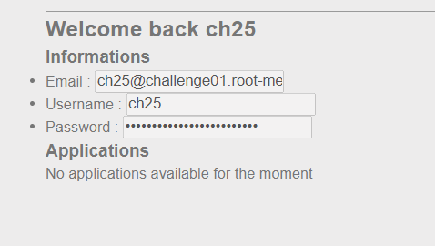

# LDAP Injection

## 1. LDAP là gì?
LDAP (Lightweight Directory Access Protocol) là một **protocol** dạng client-sever cho phép ứng dụng có thể querry thông tin trong thư mục một cách nhanh chóng\
LDAP còn có thể được sử dụng để **authentication**
>Điểm khác nhau của LDAP và SQL: LDAP là protocol dùng để truy cập thông tin trong thư mục còn SQL là ngôn ngữ truy vấn dùng cho database

## 2. LDAP Injection
LDAP Injection là một lỗ hỏng xảy ra khi câu truy vấn LDAP được concat với untrusted data từ input người dùng nhập vào mà không có bất kỳ biện pháp filter hay validate nào.\
Ví dụ câu truy vấn authentication sau: 
```LDAP
find("(&(cn=" + username +")(userPassword=" + pass +"))")
```
Câu truy vấn trên sẽ tìm người dùng có tên là username và mật khẩu là pass, nếu ``(cn=" + username +")`` và ``(userPassword=" + pass +")`` nhập vào là đúng, tìm được người dùng và đăng nhập thành công.\
Tuy nhiên nếu nhập vào ``username=*`` và ``pass=*`` thì câu truy vấn sẽ thành:
```
find("(&(cn=*)(userPassword=*))")
```
``*`` trong LDAP nghĩa là "select all", nó sẽ trả về danh sách của tất cả người dùng.\
Còn nều ta nhập vào ``username=*)(cn=*))(|(cn=*`` thì câu querry sẽ thành
```
find("(&(cn=*)(cn=*))(|(cn=*)(userPassword=" + pass +"))")
```
Câu lệnh trên sẽ luôn trả về True, ta có thể dùng nó để bypass authentication
> Giải thích : \
Đoạn ``(&(cn=*)(cn=*))`` yêu cầu 
cả 2 vế ``cn=*`` đều phải bằng True do có toán tử ``& (AND)`` . Tuy nhiên ``cn=*`` nghĩa là select all nên mặc định nó luôn đúng suy ra ``(&(cn=*)(cn=*))`` sẽ luôn dúng\
Đoạn ``((|(cn=*)(userPassword=" + pass +"))`` sẽ yêu cầu 1 trong  2 vế ``(cn=*)`` là True hoặc ``(userPassword=" + pass +"))`` là True vì nó sử dụng toán tử ``|(OR)``. Mà ``cn=*``  luôn đúng nên đoạn truy vấn này luôn đúng

## 3. Một số kiểu LDAPi
Đầu tiên là login bypass LDAPi, chính là ví dụ ở trên đã minh họa. Ta có thể sử dụng toán tử ``&(AND)`` hoặc toàn tử ``|(OR)`` để bypass\
Ví dụ sử dụng toán tử ``&(AND)``
```
user=*)(&
password=*)(&
--> (&(user=*)(&)(password=*)(&)) //cụm (&) là luôn luôn True
```
Ví dụ sử dụng toán tử ``|(OR)``
```
user=*)(|(&
pass=aaa)
--> (&(user=*)(|(&)(pass=aaa))
```
Thứ 2 là blind LDAPi

## 4. CTF Example
### A. LDAP injection - Authentication (Root-me) 

Bài này cung cấp cho ta một form login

Ta thử nhập username và password bất kỳ

Tiêu đề bài gợi ý cho ta về LDAPi ta thử nhập ``username=*`` và ``password=*``

Như vậy ``*`` đã bị filter, ta thử nhập ``username=)`` và ``password=)``

Ta nhận về error syntax của LDAP và biết được cấu trúc của câu lệnh querry, nó sẽ kiểm tra uid là ``username`` và userPassword là ``password``. Ta dùng toàn tử ``&`` để bypass với payload như sau:
```
user=*)(&
password=*)(&
--> (&(uid=*)(&)(userPassword=*)(&) // luôn luôn trả về True
``` 

Paylaod inject thành công ta chỉ cần mở source lên và nhìn flag
> **FLAG**: SWRwehpkTI3Vu2F9DoTJJ0LBO
