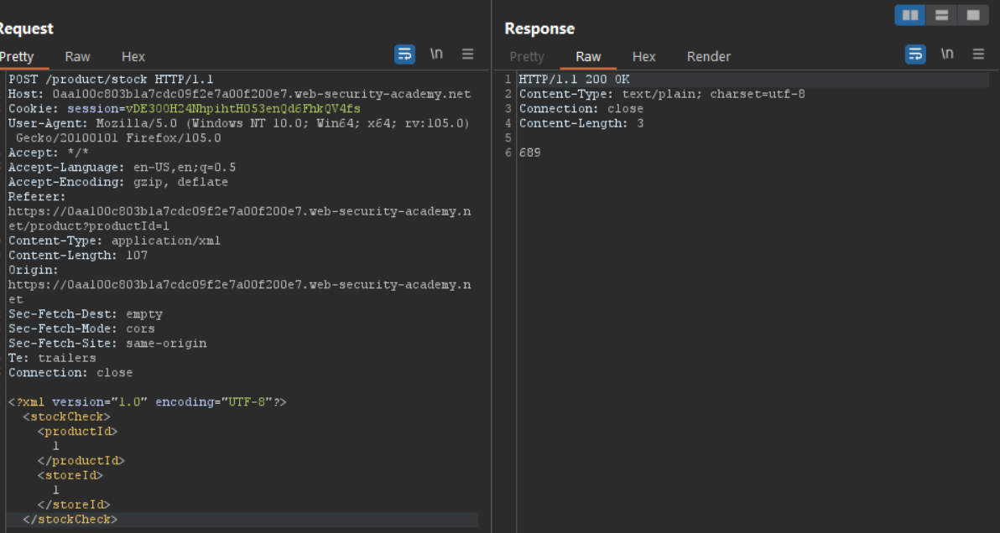

# XXE - XML External Entity
## 1. XML là gì
Thử tưởng tượng khi giao tiếp, trao đổi dữ liệu với nhau giữa 1 ứng dụng dùng java và 1 ứng dụng dùng python thì do 2 ngôn ngữ lập trình khác nhau nên sẽ xảy ra xung đột về kiểu dữ liệu của data. Điều này khuyến khích ta dùng 1 chuẩn chung được hiểu ở cả 2 và nhiều ngôn ngữ để lưu trữ và trao đổi data\
XML (eXtensible Markup Language)  được sinh ra để giải quyết vấn đề trên

XML có công dụng chính là lưu trữ và trao đổi, chia sẽ data giữa các hệ thống với nhau. Với đặc trưng là người và máy đều có thể hiểu được và có thể được đọc trên mọi hệ thống

Ví dụ XML:
```xml
<?xml version="1.0" encoding="UTF-8"?>
  <application>
      <name>endy</name>
      <mail>abc@123.com</mail>
      <collage>KMP</collage>
  </application>
```
Dòng đầu tiên là Khai báo XML (XML declaration), nó nên có chứ không bắt buộc phải có. Ở phần thân, cứ một cặp thẻ mở-đóng trong XML tạo thành một phần tử, và các phần tử này lồng nhau tạo nên cấu trúc dạng cây.
## 2. External Entity
### A. Entity là gì
Entity là một khái niệm có thể được sử dụng như một kiểu tham chiếu đến dữ liệu, cho phép thay thế một ký tự đặc biệt, một khối văn bản hay thậm chí toàn bộ nội dung một file vào trong tài liệu xml.\
Hay có thể hiểu đơn giản việc dùng ``entity`` giống như là kh
ai báo biến trong lập trình\
Entity có 2 loại là internal entity và external entity
### B. Internal Entity
Internal entity là entity tham chiếu đến một giá trị được khai báo bên trong file xml\
Ví dụ:
```xml
<?xml version="1.0" encoding="UTF-8"?>
<!ENTITY age "19">
  <application>
      <name>endy</name>
      <mail>abc@123.com</mail>
      <collage>KMP</collage>
      <age>&age;</age>
  </application>
```
> Để gọi tới một entity thì ta thêm ``&`` vào đầu và ``;`` vào cuối tên entity
### C. External Entity
External entity là entity tham chiếu đến nội dung một file bên ngoài tài liệu xml\
Ví dụ:
```xml
<?xml version="1.0" encoding="UTF-8"?>
<!ENTITY message SYSTEM "./message/endy.txt">
  <application>
      <name>endy</name>
      <mail>abc@123.com</mail>
      <collage>KMP</collage>
      <message>&message;</message>
  </application>
```
> Để khai báo external entity thì ta thêm từ khóa ``SYSTEM``

Từ cơ chế external entity attacker có thể lợi dụng để thực hiện XXE injection

## 3. XXE
XML external entity injection hay XXE là một lỗ hổng web cho phép attacker có thể can thiệp vào quá trình xử lý dữ liệu XML của ứng dụng. Cho phép attacker xem bất kỳ file nào trên hệ thống thông qua external entity.\
Trong một vài trường hợp cuộc tấn công XXE có thể leo thang lên thành SSRF

> Tại sao lỗ hỏng XXE phát sinh? Do web thực hiện việc trao đổi thông tin bằng tài liệu XML nhưng dùng các parser mặc định, tiêu chuẩn. Và khi attacker thực hiện XXE thì các parser này vẫn sẽ đọc file và trả về kết quả không một chút nghi ngờ rằng tài liệu XML đã được inject payload

Các loại hình tấn công XXE:
- Exploiting XXE to retrieve files
- Exploiting XXE to perform SSRF attacks
- Exploiting blind XXE exfiltrate data out-of-band
- Exploiting blind XXE to retrieve data via error messages

## 4. Exploiting XXE to retrieve files
Dạng tấn công này ta sẽ dùng XXE để đọc 1 file bất kỳ của sever

Ví dụ : Lab1 XXE injection portswigger
Lab cho ta một trang web check số lượng của một mặt hàng nào đó. Khi chọn 1 mặt hàng và check số lượng, ta bắt được request là một tài liệu XML



Ta tiến hành XXE bằng payload sau:
```xml
<?xml version="1.0" encoding="UTF-8"?>
<!DOCTYPE foo [ <!ENTITY xxe SYSTEM "file:///etc/passwd"> ]>
<stockCheck><productId>1
&xxe;
</productId><storeId>1</storeId></stockCheck>
```
Dòng ``<!DOCTYPE foo [ <!ENTITY xxe SYSTEM "file:///etc/passwd"> ]>`` để đọc file /etc/passwd và dùng ``&xxe;`` để xuất nội dung file ra respone\
Kết quả:


